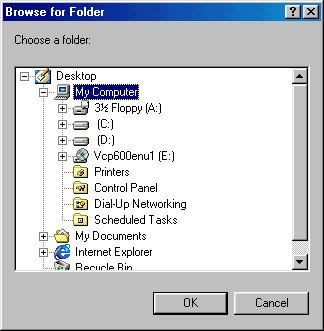



## Browse For Folder Shell Dialog

### Description

I guess everyone knows what is the Shell Browse For Folder dialog is, but there was no way to show under Visual Basic because the API Viewer doesn't has all of the API calls.

But here it is, an API call for it, usefull in choosing specific files/folders
 
### More Info
 

             |
---                |---
**Submitted On**   |2000-02-25 22:33:36
**By**             |[Max Raskin](https://github.com/Planet-Source-Code/PSCIndex/blob/master/ByAuthor/max-raskin.md)
**Level**          |Advanced
**User Rating**    |4.2 (25 globes from 6 users)
**Compatibility**  |VB 5\.0, VB 6\.0
**Category**       |[Windows API Call/ Explanation](https://github.com/Planet-Source-Code/PSCIndex/blob/master/ByCategory/windows-api-call-explanation__1-39.md)
**World**          |[Visual Basic](https://github.com/Planet-Source-Code/PSCIndex/blob/master/ByWorld/visual-basic.md)
**Archive File**   |[CODE\_UPLOAD36082252000\.zip](https://github.com/Planet-Source-Code/max-raskin-browse-for-folder-shell-dialog__1-6260/archive/master.zip)

